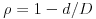
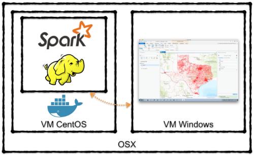
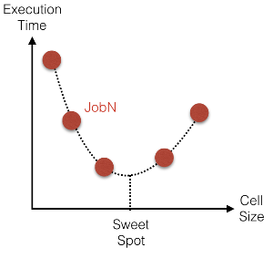
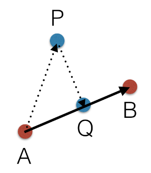
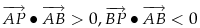
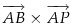
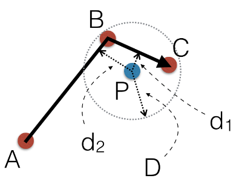
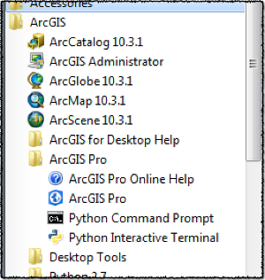
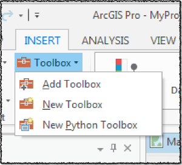
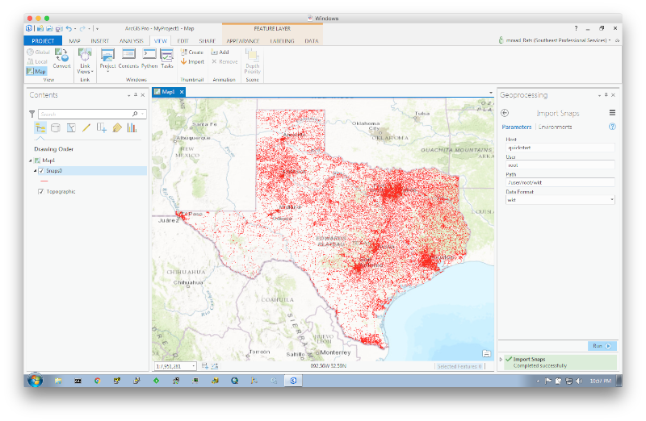

# Spark Snap Points

[Spark](http://spark.apache.org/) job to perform reduce side spatial join to snap a massive set of points to a massive set of lines and visualize the result in [ArcGIS Pro](http://www.esri.com/en/software/arcgis-pro).

In this implementation, the lines are in a feature class in a file geodatabase and the points are in a CSV file. And because we are in BigData space, both data sources are in [HDFS](https://hadoop.apache.org/docs/r1.2.1/hdfs_design.html).
The main application uses the [spark-gdb](https://github.com/mraad/spark-gdb) API and the [spark-csv](https://github.com/databricks/spark-csv) API to load the raw data as features to be spatially joined.
The result of the join is a set of rows where each row consists of:
- The original point coordinates.
- The snapped point coordinates.
- The perpendicular snap distance.
- The distance along the snapped line.
- A snap factor  where `d` is the snap distance and `D` the max snap distance. 
- The original point identifier
- The snapped line identifier

The result set can be emitted in either [Parquet](https://parquet.apache.org), [Avro](https://avro.apache.org) or text format, where in the latter the fields are `\t` separated and the origin to snap point linestring geometry is in [WKT](https://en.wikipedia.org/wiki/Well-known_text) format. This project includes an [ArcPy](http://help.arcgis.com/en/arcgisdesktop/10.0/help/index.html#//000v000000v7000000.htm) based toolbox to view the snapped segments in [Pro](http://www.esri.com/en/software/arcgis-pro).

The following diagram illustrates my development environment:


For Docker, HDFS and Spark, we will be using the [Cloudera Quickstart Container](http://www.cloudera.com/documentation/enterprise/5-6-x/topics/quickstart_docker_container.html). 

## Spatial Join

The distributed spatial join is based off the published [SpatialHadoop](http://www-users.cs.umn.edu/~mokbel/papers/icde15a.pdf) paper of Mokbel et al.
Performing a map side join versus a reduce side join is heavily dependent on the amount of memory allocated per partition per node to a job. 
If one of the input sets is small enough to fit in the allocated memory of a job partition, then a map side join can be achieved.
In Spark, this is achieved by creating a [Broadcast Variable](http://spark.apache.org/docs/latest/programming-guide.html#shared-variables) of a spatial index of the smaller set, and the bigger set rows
are mapped in such that a spatial operation is performed off the broadcast referenced spatial index.
In the case where either input set cannot fit in the allocated memory of a job partition, the input data is partitioned by neighborhood into
smaller subsets, in such that each subset can fit into the allocated memory of a job partition to perform a localized in memory spatial operation.
The simplest neighborhood partitioning is cookie cutting the input space into uniform square cells, in such that all the data that is inside or overlaps a square cell is processed in-memory together.


In Spark, this is achieved by mapping the input based on its envelope to one or more cell, and performing a spatial join on the `groupByKey` set.
The `groupByKey` operation can cause an Out-Of-Memory exception if the cookie cutting cell is too big, or can cause excessive Spark shuffling if the cell size is too small.
What is the correct cell size ? Well, this is very dependent on the data, the spatial operation and the cluster resources.
A heuristic approach that maps the cell size to a minimized desired metric (ie. execution time, allocated memory) should be undertaken to locate the "sweet spot".



## Anatomy of a Snap

The math to project a point onto a line segment is well documented by [Wolfram](http://mathworld.wolfram.com/Point-LineDistance2-Dimensional.html).



Given a directed line segment defined by start point `A` and end point `B`, and given point `P`, we need to find:
- Point `Q`, where `PQ` is perpendicular to `AB`
- Length of the segment `PQ`
- Length of segment `AQ`
- Side of the line `AB` where the point `P` resides (left, right or on the line)

Point `P` is "snappable" to segment `AB` if  and then the side can be determined by the direction of .
Remember, the [dot product](https://en.wikipedia.org/wiki/Dot_product) value of two vectors is a reflection of their alignment, where 1 means perfectly aligned and -1 means they are in opposite direction.
And the [cross product](https://en.wikipedia.org/wiki/Cross_product) of two vector is a reflection of how perpendicular they are to each other. 
Given a max distance `D`, the closest distance to a line can be searched and determined as illustrated below:



## Building the Project

This project is built using [Maven](https://maven.apache.org/) and depends on [spark-gdb](https://github.com/mraad/spark-gdb). Clone the project and build a `quickstart` version

```bash
git clone https://github.com/mraad/spark-gdb.git
mvn -P quickstart clean install
```

Building this project:

```bash
mvn -P quickstart package
```

## Dockerize the Application

Download and install the [Docker Toolbox](https://www.docker.com/products/docker-toolbox) and create a docker machine in [VirtualBox](https://www.virtualbox.org/wiki/Downloads):
```bash
docker-machine create\
 --driver virtualbox\
 --virtualbox-memory 4096\
 --virtualbox-cpu-count 4\
 --virtualbox-disk-size 40960\
 --virtualbox-no-vtx-check\
 quickstart
```

Get the IP of the machine:
```bash
docker-machine ip quickstart
```

Set the docker environment variables:
```bash
eval $(docker-machine env quickstart) 
```

As superuser on your host, update the local `/etc/hosts` file to include the `quickstart` docker-machine:
```bash
copy /etc/hosts /etc/hosts-orig
echo -e "\n$(docker-machine ip quickstart) quickstart.cloudera cloudera.quickstart quickstart cloudera qs" >> /etc/hosts
```

On Windows as **administrator** update `C:\Windows\System32\drivers\etc\hosts` to include the docker machine ip and reference `quickstart.cloudera`.

Run the docker [cloudera/quickstart](https://hub.docker.com/r/cloudera/quickstart/) image exposing a set of Hadoop and Spark specific ports and map the `/Users` volume in such that you can navigate to the compiled jar inside the container:
```bash
docker run\
 --rm\
 --privileged=true\
 --hostname=quickstart.cloudera\
 -v /Users:/Users\
 -p 2181:2181\
 -p 4040:4040\
 -p 7180:7180\
 -p 8020:8020\
 -p 8032:8032\
 -p 8033:8033\
 -p 8042:8042\
 -p 8080:8080\
 -p 8088:8088\
 -p 8888:8888\
 -p 9083:9083\
 -p 10000:10000\
 -p 21050:21050\
 -p 28080:28080\
 -p 50010:50010\
 -p 50020:50020\
 -p 50060:50060\
 -p 50070:50070\
 -p 50075:50075\
 -p 50111:50111\
 -t -i cloudera/quickstart\
 /bin/bash
```

Start Zookeeper, HDFS, WebHDFS, YARN and Spark:
```
DAEMONS="\
cloudera-quickstart-init \
zookeeper-server \
hadoop-hdfs-datanode \
hadoop-hdfs-namenode \
hadoop-hdfs-secondarynamenode \
hadoop-httpfs \
hadoop-yarn-nodemanager \
hadoop-yarn-resourcemanager \
spark-history-server"

for daemon in ${DAEMONS}; do
    sudo service ${daemon} start
done
```

## Points and Lines

For the lines, we will use the [TxDOT published roadway inventory data](http://www.txdot.gov/inside-txdot/division/transportation-planning/roadway-inventory.html).

**In the container**, download the zip file, unzip it and put the roadway geodatabase in HDFS:
```
pushd /tmp
curl -O http://ftp.dot.state.tx.us/pub/txdot-info/tpp/roadway-inventory/2014.zip
unzip 2014.zip TXDOT_Roadway_Inventory.gdb/*
hadoop fs -put TXDOT_Roadway_Inventory.gdb
popd
```

For the points, we will use an [AWK](http://www.gnu.org/software/gawk/manual/gawk.html) script (`points.awk`) to generate 1,000,000 random data points in the bounding box of the roadway data.
The result will be saved in HDFS as a CSV file.

```
awk -f points.awk | hadoop fs -put - points.csv
```

## Snapping Points to Lines

**In the container**, navigate to the folder containing this project (assuming that it is accessible via `/Users`) and you will see two shell scripts:
- `avro-submit.sh`: submits a spark job where the snapped line segments result in HDFS in Avro format.
- `wkt-submit.sh`: submits a spark job where the snapped line segments result in HDFS in TSV format and the line segments are in WKT.

Now remember, this will _not_ be blindingly fast, as we only allocated 4 cores and 4 GB of memory to the container :-)

## Viewing HDFS Results

To make [Pro](http://www.esri.com/en/software/arcgis-pro) talk to HDFS via ArcPy and to consume Text/WKT/Avro files, we need to install a couple of python modules:
- [fastavro](https://pypi.python.org/pypi/fastavro)
- [hdfs](https://pypi.python.org/pypi/hdfs/)
- [snappy](https://pypi.python.org/pypi/python-snappy) - Download pre-compiled [python_snappy-0.5-cp34-none-win_amd64.whl](http://www.lfd.uci.edu/~gohlke/pythonlibs/#python-snappy)

This is accomplished by **running as administrator**, the Python Command Prompt.

and execute:
```
pip install python_snappy-0.5-cp34-none-win_amd64.whl
pip install fastavro hdfs
```

Add the toolbox `SnapToolbox.pyt` from `src\main\python` to Pro using `Insert`->`Toolbox`->`Add Toolbox`.


Run the tool:


